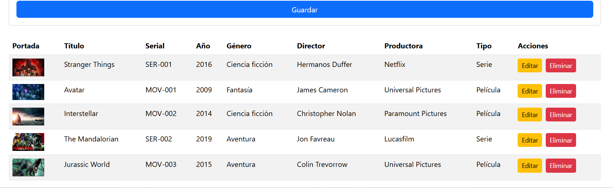

# 🎬 Frontend – Gestión de Películas y Series (React)

Este frontend forma parte del proyecto GR06 y permite gestionar películas, series y sus entidades relacionadas mediante una interfaz web construida con **React**.  
Se conecta a la API del backend para realizar operaciones CRUD completas.

---

## 🚀 Tecnologías utilizadas

- React
- React Router
- Axios
- Bootstrap / CSS
- JavaScript (ES6+)

---

## 📁 Estructura del proyecto

frontend/
│ 
├── src/ 
│   ├── components/ 
│      ├── Generos/ 
│      ├── Directores/ 
│      ├── Productoras/   
│      ├── Tipos/    
│      └── Medias/ 
│
├── services/ 
│   ├── generoService.js 
│    ├── directorService.js 
│   ├── productoraService.js 
│   ├── tipoService.js 
│   └── mediaService.js 
│  
├── screenshots
│   ├── Modulo director
│   ├── Modulo genero
│   ├── Modulo media
│   ├── peliculas-series
│   ├── Modulo productora
│   ├── Modulo tipo
│
├── App.js
├── App.css 
├── package.json
├── package-lock.json
├── index.js
├── index.css
├── logo.svg
├── reportWebVitals.js
├── setupTests.js
├── .gitignore
├──README.md

---

## ⚙️ Instalación y ejecución

### 1️⃣ Instalar dependencias

``bash
npm install
npm start

---

## 😊 La aplicación se abrirá en:
http://localhost:3000

---

## 🌐 Rutas principales
- /generos
- /directores
- /productoras
- /tipos
- /media
## Cada módulo incluye:
- Formulario de creación
- Tabla de registros
- Botones de editar y eliminar
- Selects dinámicos cargados desde la API
- Portadas visibles en el módulo Media

---

## 🔗 Conexión con el backend
El frontend consume la API ubicada en:
http://localhost:4000/api

Los servicios están en:
src/services/

---

## 🎨 Características de la interfaz
- Formularios claros y validados
- Tablas dinámicas con acciones
- Portadas visibles
- Selects cargados desde la API
- Diseño limpio y fácil de usar

---

## 📸 Capturas de pantalla

A continuación se presentan las pantallas del sistema de gestión de películas y series.

---

### 🎬 Módulo Media

---

### 🎬 Vista general de Películas y Series

---

### 🎭 Módulo Género

---

### 🎥 Módulo Director

---

### 🏢 Módulo Productora

---

### 🎞️ Módulo Tipo

---

## 👩‍💻 Autoras

**Disbeidy Anzueta Gongora y Daniela Anzueta Gongora**  
Estudiantes de Tecnología en Desarrollo de Software  
Institución Universitaria Digital de Antioquia 

---

##📄 Licencia
Proyecto de uso académico.

---
